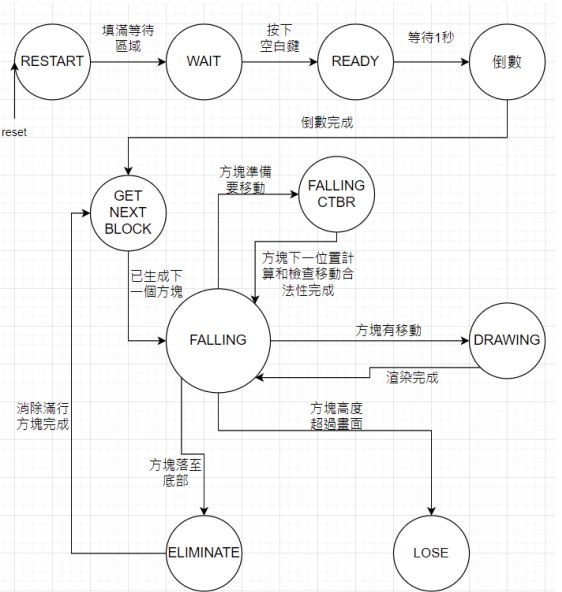
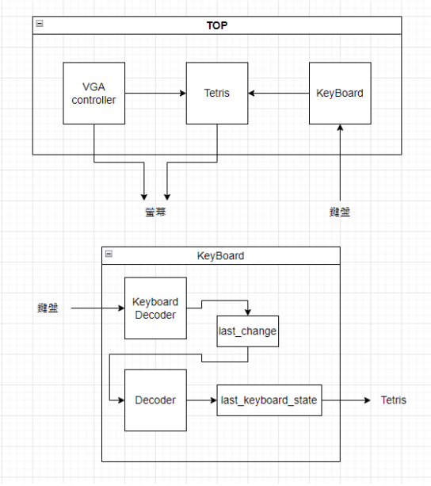
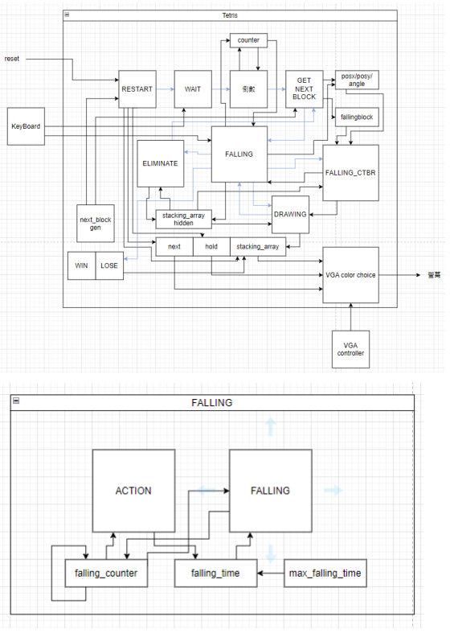

# 🎮 FPGA-based Tetris System

> **Role:** System Architect & Lead Developer
> **Key Contributions:** Designed the complex Finite State Machine (FSM) for game logic, implemented the VGA rendering pipeline, and optimized logic depth to resolve synthesis failures.

## 📖 Project Overview
This project implements a fully hardware-accelerated **Tetris** game on an FPGA platform. Unlike software-based implementations, the game logic, rendering, and input processing are executed in parallel using **Digital Logic Circuits** described in Verilog.

The system features a custom **VGA Controller** for real-time video output and a **PS/2 Interface** for keyboard interaction, demonstrating a complete Hardware-Software (Human-Machine) interface integration. While initially designed for 2-player battles, the final release focuses on a highly optimized single-player experience with rich features like "Hold", "Next Block Preview", and increasing difficulty.

---

## ⚙️ Key Features

* **Core Gameplay:** Full Tetris mechanics including **SRS (Super Rotation System)** logic, line clearing, gravity, and soft/hard drops.
* **7-Bag Randomizer:** Implemented a **Linear Feedback Shift Register (LFSR)** with a lookup table to ensure fair piece distribution (all 7 tetrominoes appear once per cycle).
* **Hardware Rendering:** Real-time VGA output (640x480) with custom sprite logic for the board, hold queue, and next piece preview.
* **Robust Input Handling:** PS/2 keyboard decoder supporting complex key combinations (e.g., moving while rotating).

---

## ⚙️ Finite State Machine (FSM) Design

The game flow is controlled by a robust FSM to ensure deterministic behavior in hardware. The diagram below illustrates the comprehensive state transition logic designed for the system.

  
   
  <em>Figure 1: Complete State Transition Diagram describing the game logic lifecycle.</em>
  
  
   
  <em>Figure 2 & 3: Block diagrams for different modules.</em>

### State Descriptions
* **RESTART / WAIT:** Initializes game registers and waits for user start.
* **READY / COUNTDOWN:** Displays a "3-2-1" graphical countdown before gameplay begins.
* **GET_NEXT_BLOCK:** Dequeues a block from the `Next` buffer and triggers the LFSR generator.
* **FALLING / ACTION:**
    * Handles user inputs (Rotation/Movement) and gravity.
    * Transitions to **`FALLING_CTBR` (Check-To-Be-Real)** to validate move legality before updating coordinates.
* **ELIMINATE:** Scans for full rows using dual pointers to execute line clearing.
* **DRAWING:** Updates the `stacking_array` for the next VGA frame rendering.
* **LOSE:** Detects if the stack exceeds the board height.

## 🔧 Engineering Challenges & Solutions
1. Synthesis Failure & Logic Optimization
* **Problem**: An early version attempted to handle all collision logic and state updates within a single clock cycle using deeply nested `case` statements. This resulted in excessive combinational logic depth, causing Synthesis Failure and routing congestion on the FPGA.

* **Solution**: We refactored the architecture by separating the "Falling Block" state from the "Static Stack" (`stacking_array_hidden`). We also decomposed complex transitions into multi-cycle operations (e.g., `FALLING` ->`FALLING_CTBR`-> `DRAWING`), reducing the critical path and allowing successful bitstream generation.

2. Pseudo-Randomness in Hardware
* **Challenge**: True randomness is difficult to achieve in digital logic without external entropy.

* **Solution**: We implemented a Linear Feedback Shift Register (LFSR) seeded with initial states. To adhere to modern Tetris standards, we implemented a 7-bag cycle logic, ensuring a balanced distribution of pieces .

## 🎮 Controls

The game supports flexible input methods, allowing control via Arrow Keys, WASD-style keys, or Numpad.

| Key(s) | Action | Description |
| :--- | :--- | :--- |
| **`←` / `4`** | **Move Left** |Shift the tetromino to the left |
| **`→` / `6`** | **Move Right** | Shift the tetromino to the right |
| **`↑` / `X` / `5` / `1` / `9`** | **Rotate CW** | Rotate 90° Clockwise|
| **`Ctrl` / `Z` / `3` / `7`** | **Rotate CCW** | Rotate 90° Counter-clockwise  |
| **`↓` / `2`** | **Soft Drop** |Accelerate falling speed (Move down)|
| **`Space`** | **Hard Drop** | Instantly lock the piece at the bottom |
| **`Shift` / `C` / `0`** | **Hold** | Swap current piece with hold buffer|

## 🧪 Experimental Results
* Resource Utilization: Successfully synthesized on [Xilinx Basys 3].

* Timing Analysis: Achieved stable VGA output at 25MHz clock frequency without visual artifacts.

* Functionality: Verified all core mechanics including SRS logic, Hold mechanism, and increasing gravity speed over time.

## Contributors
* Shu-Jui Chang (張書睿): System Architecture, FSM Design, VGA Rendering Logic, Synthesis Optimization.

* Cheng-Han Tsai (蔡承翰): PS/2 Decoder Implementation, UI Layout Design, Gameplay Tuning.

## 📷 Gallery
1. Game Start & UI

2. Gameplay Action

3. Game Over

